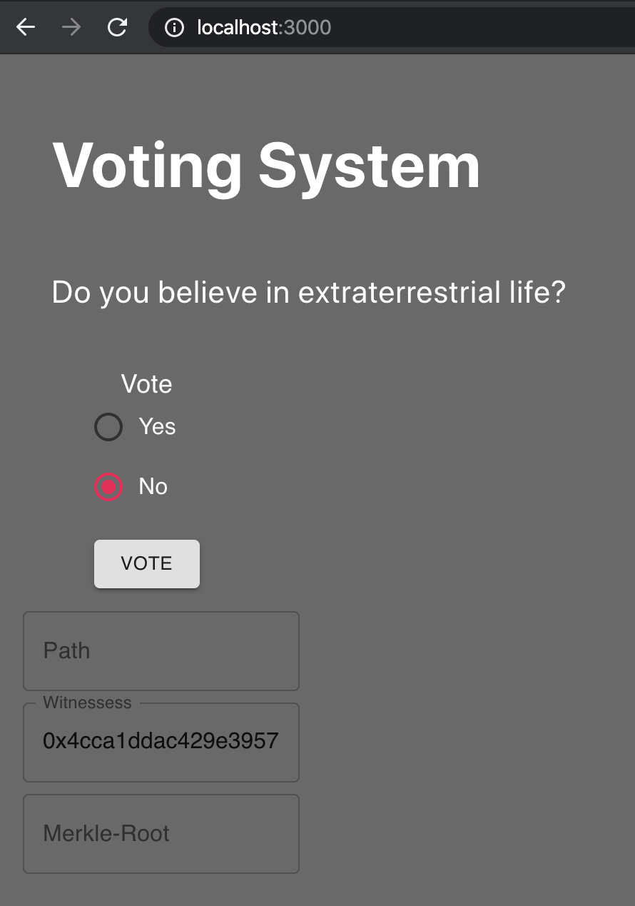

# Voting System Project

This Project goal is to simulate a voting system on Ethereum Blockchain using merkle tree to make it viable by authenticating voters off-chain. This REPO you can find:

- Voting Solidity Contract
- Truffle contract testing files
- Initial Layout of web application
- NodeJS Merkle tree generator program and others resources

## Getting Started

Clone this project from https://github.com/eduardopezzi/Offchain_vote_system
On the project folder type npm install command

The initial setup for running properly is to run Ganache (Cli or desktop version), and copy the first and second accounts from Ganache and paste into the addresses.txt, and run truffle test command. Make sure that your Ganache is running under the port 7545.

## Prerequisites

Npm ^6.13.4

Truffle 5.0.42

Ganache

### Tests

Test run the contract and begins with a simple test just to verify if contract was deployed and test its address.

Test 1 - It tests the eligibleVotersMerkleRoot variable that is one constructor argument. It should match with the Merkle Root generated from the voter's addressse file (./resources/addresses.txt).

Test 2 - It tests the owner variable, if it got the correct one.

Test 3 - This is testing the contract's main function. It simulates casting a vote, taking your Ganache's second account to generate a witnessess array and Merkle tree path and paste this information with your vote to the contract. To certify that the transaction succeed, the test assert if a Voted event was emitted as well as if the vote was incremented to the results of the poll.

## Web Interface

As a prototype, the web application is not fully developed yet. But it was developed as a start to future development, interacting with metamask and the contract.

The idea is in the server side, vote-tree.js program will run the functions and auto complete, path, witnesses and merkelroot, while the interface working with metamask, will provide the user address to generate this information. Therefore, this application can be more dynamic, been able to add more address along the polling period and also having multiple polls within the same application.

## Authors

- **Eduardo Pezzi**

## License

This project is licensed under the MIT License - see the [LICENSE.md](https://opensource.org/licenses/MIT) file for details
